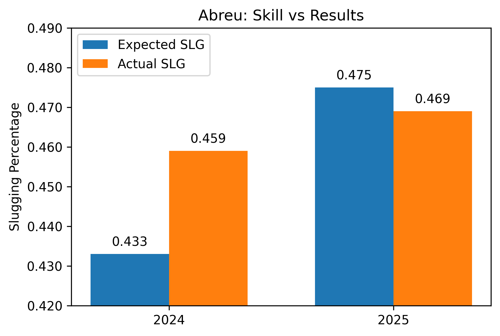
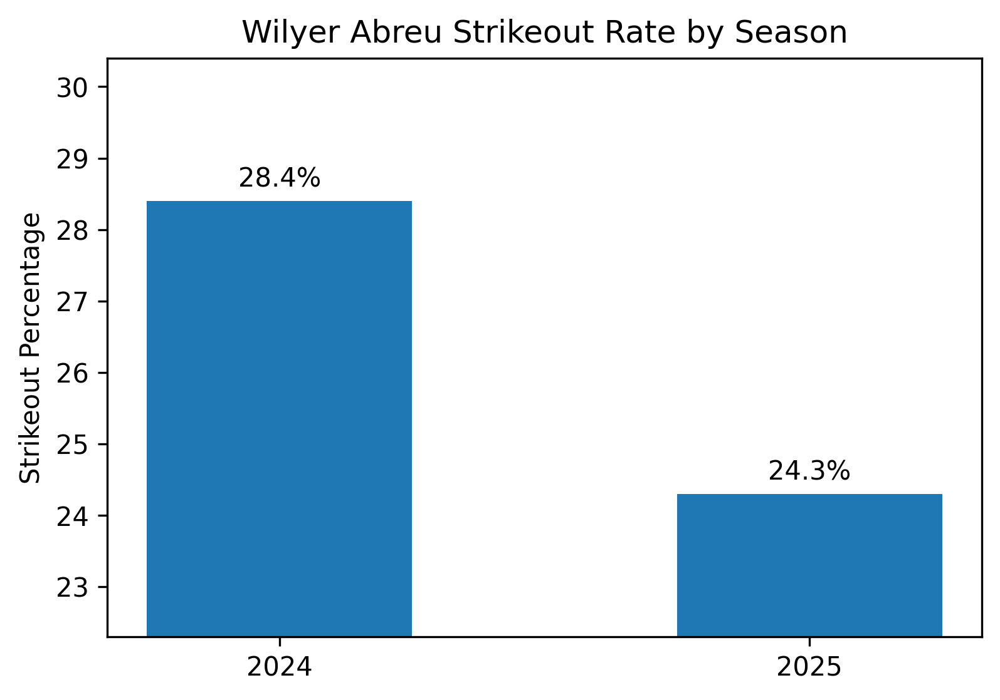

# Wilyer Abreu 2026 outlook
Data-driven performance outlook for the 2026 season
## Project Goal
Evaluate year to year production to try and predict future performance.
## Data Used
-Batting data from 2024 and 2025 season, including:
-Slugging Percentage (SLG)
-Expected Slugging Percentage (xSLG)
-Strikeout rate (K%)
-Walk rate (BB%)
## Key Findings
-Expected slugging increased .042 points from 2024 to 2025, indicating a notable increase in quality of contact.
-Actual slugging increased by .010, suggesting results have not fully reflected the increase in quality of contact.
-Strikeout rate decreased by 4 percentage points (18 percentile point increase)
-Walk rate increased by 0.7 percentage points (6 percentile point increase)
## Visualizations 

### Expected vs Actual Slugging

### Strikeout Rate
 

## S.P.E.C.I.A.L Breakdown
**Strength (7/10)** Has had top 20th percentile bat speed back to back years. Was in top 6 percent of hitters in hard hit percentage and in the top 14 percent in average exit velocity in 2024, numbers regressed to league average in 2025 but still showcased the elite power potential. Consistently top 3 percentile of arm strength.
**Perception (4/10)** Even with improvement last year, has still showcased league average to well below league average plate discipline. In 2025, Wilyer was league average in whiff percentage while being bottom half in chasing pitches and bottom third in strikeout percentage. Though he was in top third of league in walk percentage and trending up.
**Effectiveness (6/10)** Elite fielder with above average slugging percentage and mid 20s home run potential from the left side reads as an effective player. Does not add much with his legs but the bat and mainly the glove are enough.
**Consistency (6/10)** Similar end of year counting and rate stats with slight upticks virtually across the board. Underlying numbers look a little different year to year but end results have been consistent.
**Improvement (7/10)** Slight improvement in all major stats across the board with reason to believe they will continue to trend up.
**Agility (8/10)** Elite fielder with elite range and arm strength while sporting league average sprint speed and being a negative on the basepath.
**Luck (6/10)** Overperformed earlier in his career but now has very similar expected and actual numbers. 
## Conclusion
Increases in quality of contact and plate discipline show steady growth, indicating offensive upside entering 2026 season.
## Tools Used
Python, pandas, matplotlib

